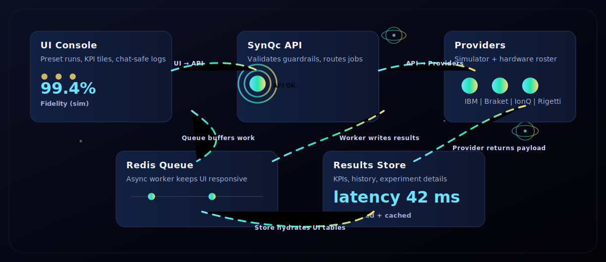
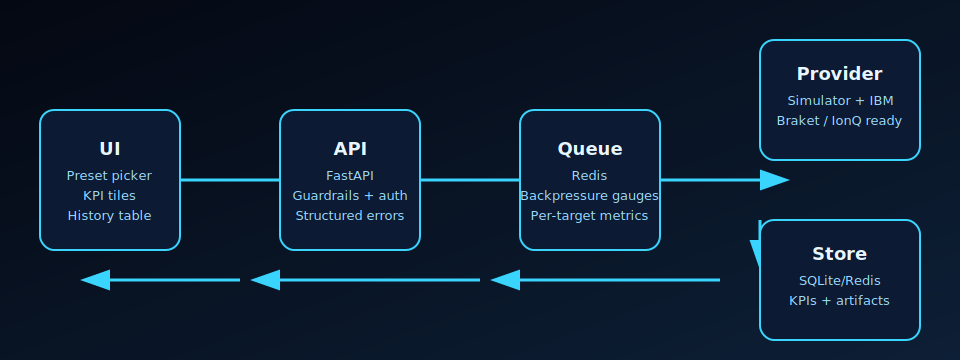

# SynQc TDS – Hybrid Controller

SynQc TDS is a “traffic controller” for complex computing jobs. You press a button, it decides whether the work runs on your normal computer or a quantum service, runs it safely in the background, and shows the results in a dashboard.

You do **not** need quantum hardware or deep physics knowledge to use this project. SynQc TDS is designed so developers can:
- Run advanced experiments safely
- Track performance and timing
- Test ideas locally before ever touching real quantum machines
- Fine tuning

Think of SynQc TDS like a **smart traffic controller**: it decides *when*, *where*, and *how* different computations should run so nothing crashes, stalls, or behaves unpredictably.

# SynQc TDS Console — Sleek Repo v0.4


### Why this exists

Quantum experimentation is fragmented; SynQc standardizes runs, KPIs, and budgets so teams can compare simulator and hardware targets without rewriting tooling.

### 20-second “how it works”

UI → API → Queue → Provider → Store → UI

<p align="center">
  
  <br /><em>The SVG animates the UI → API → queue → providers → store loop; if it appears static on GitHub, click to view the raw file and the motion will play.</em>
</p>



### Roadmap

- Simulator-first baseline for reproducible demos
- IBM/Qiskit integration milestone for live and Aer runs
- Braket milestone behind the provider registry
- Hosted demo milestone so prospects can click before cloning (see [Hosted Demo Playbook](docs/Hosted_Demo.md))

## Demo

- docker compose up --build
- export OPENAI_API_KEY=<your key> so the SynQc Guide can reach GPT-4o-mini (docker compose forwards it to the API and worker)
- optional: set SYNQC_AGENT_CHAT_LIMIT_REQUESTS / SYNQC_AGENT_CHAT_LIMIT_WINDOW_SECONDS to cap agent chat traffic in noisy envs
- open [`web/index.html`](web/index.html) (works offline; add `?api=http://localhost:8001` when the backend is running)
- click “Run preset”
- see KPIs + history + experiments table + details view
- GitHub
- +1
- Optional: follow [`docs/Dual_Clocking_Qubits_Integration.md`](docs/Dual_Clocking_Qubits_Integration.md) to run the Dual-Clocking-Qubits toolkit as a sidecar without changing this repo. A staging folder lives at `tools/dual-clocking-qubits`; run `./scripts/fetch_dual_clocking_tool.sh` to download or update the toolkit when network access is available.
- Use the hosted demo playbook in [`docs/Hosted_Demo.md`](docs/Hosted_Demo.md) to publish the static UI and point it at a reachable backend with CORS configured for your chosen origin.

### SynQc preset demo (simulator)

- Console setup: keep the **Shot budget** and **Target** labels short so they fit inside the panel headers.
- Run: press **Run preset** once and let the simulator autopopulate the KPI tiles and history rows.
- KPIs: expect fidelity, latency, and backaction readouts to stay inside each tile without wrapping.
- Tables: use the inline filters on **History** and **Experiments**; the text is trimmed to fit within each cell.

> **Grover search badge (ψ)** — the Agent panel shows a glowing ψ badge and bold “Grover search ready” copy. It means the UI will submit the **Grover search preset** to the backend, which executes a real Qiskit/Aer Grover circuit (not a toy counter). If Qiskit isn’t installed, the backend will return a clear error asking you to install `backend[qiskit]` or switch to a live provider.

### Two-process layout (synqc-api + synqc-worker)

- The FastAPI service **synqc-api** handles ingress, auth, and queue status.
- The dedicated worker **synqc-worker** pulls run requests from Redis and executes them so the UI stays responsive.
- Scale workers independently (`docker compose up --build` now starts both services alongside Redis and the web UI).

### VS Code / dev container quickstart

- Open the repo in VS Code and choose **Reopen in Container** to use the bundled `.devcontainer` (Python 3.12 + Docker-in-Docker) with `backend[dev,qiskit,braket,ionq]` ready.
- The dev container bakes in pre-built wheels from `backend/requirements.lock` (core + Qiskit + Braket + IonQ) so installs stay fast and deterministic even behind strict proxies. A scheduled workflow also builds a Qiskit wheel cache tarball, uploads it to a `qiskit-cache-latest` release, mirrors it to GitHub Packages (with a `latest` alias), and prunes old package versions (default 5, overridable via a workflow input or repo variable/secret) to keep the registry lean for offline use.
- Use the provided tasks (Terminal → Run Task…) to run the API, worker, tests, or bring up the full Docker demo without extra setup.

This repository combines:
- Grovers Algorithm 
- The **approved SynQc TDS frontend console look** (single-file UI).
- A **FastAPI backend** that runs SynQc experiment presets and returns KPIs.
- The **SynQc Temporal Dynamics Series technical archive** (for engineering + GPT context).
- A **GPT Pro context instruction file** for configuring a SynQc Guide assistant.
- A **five-vendor hardware target roster** (AWS Braket, IBM Quantum, Microsoft Azure
  Quantum, IonQ Cloud, Rigetti Forest) plus the local simulator, illustrating how
  SynQc TDS plugs into a consumer hardware stack and software pipeline while
  preserving correction/accuracy and prediction workflows.
  - Remote shells remain available for hosted deployments; the simulator is a safe
    default, but set `SYNQC_ALLOW_REMOTE_HARDWARE=true` (and provider credentials)
    to route jobs to live backends.

## What’s new in v0.4

- Primary nav is now **fully functional** and maps to real backend capability:
  - **Console**: run presets + KPIs + inline history
  - **Experiments**: read-only list from `GET /experiments/recent` (click a row to open Details)
  - **Hardware**: list from `GET /hardware/targets`
  - **Details**: record view from `GET /experiments/{id}` (replaces misleading “Logs”)
- Fixed a JavaScript brace issue so the UI script executes reliably.
- Filters now work independently on both Console history and the Experiments page.

## What’s new in v0.3

- Frontend visuals upgraded (still single-file, no external assets):
  - Bloch “atmosphere”, rotating rings, animated trace paths, and a DPD timeline spark.
  - KPIs now drive subtle animation cues (fidelity ↔ glow, latency ↔ spin speed, backaction ↔ noise).
- Setup panel pulls backend guardrails from `GET /health`:
  - `max_shots_per_experiment` drives the **Shot budget max** label and input clamp.
  - `default_shot_budget` is used when the field is empty/invalid.
- `GET /hardware/targets` respects `allow_remote_hardware` (filters non-sim targets when disabled).
- Added a single-file, fullstack review artifact: `docs/SYNQC_FULLSTACK_ONEFILE_v0.4.md`.
- Control panel includes the credit line: **Developed by eVision Enterprises**.

## What’s new in v0.2

- Frontend chat logging is now **XSS-safe** (no `innerHTML`; all message text is rendered via `textContent`).
- Frontend now includes a **Run preset** action wired to the backend:
  - Calls `POST /experiments/run`
  - Updates KPI tiles + run history
  - Pulls `/hardware/targets` + `/experiments/recent` on load
- Backend CORS is adjusted for sanity: wildcard origins allowed for local dev, **credentials disabled**.
- Backend includes **production-targeted provider shells** (AWS / IBM / Microsoft / IonQ / Rigetti) plus the simulator so the UI and API remain stable while credentials and live SDKs are wired in.

---

## Repo layout

- `web/index.html`
  - The console UI (portable, no external assets).  
  - By default it assumes the backend is running at `http://localhost:8001`.
  - Override with `?api=http://HOST:PORT` (example below).

- `backend/`
  - Python package `synqc_backend` (FastAPI + engine + storage).

- `archives/`
  - Optional hosted packs, overlays, add-ons, patch bundles, and cryptography scaffolds that used to live in the repository root.
  - See `archives/README.md` for a quick index.

- `docs/SynQc_Temporal_Dynamics_Series_Technical_Archive_v0_1.md`
  - Full technical archive (design + guardrails + workflow reference).

- `docs/Process_and_System_Instructions.md`
  - Single location for running SynQc TDS locally, in Docker, in hosted mode, and with optional add-ons.

- `gpt/SynQc_GPT_Pro_Context_Instructions_v0_1.md`
  - Copy/paste instructions for building a GPT called **SynQc Guide** using the knowledge file above.

---

## Run it locally (Windows-friendly)

### 1) Start the backend

From the repo root:

```powershell
py -3.12 -m venv .venv
.\.venv\Scripts\Activate.ps1
pip install -e .\backend
uvicorn synqc_backend.api:app --host 127.0.0.1 --port 8001 --reload
```

Open backend docs:
- `http://127.0.0.1:8001/docs`

### 2) Open the frontend

Option A (fastest): open `web/index.html` directly in your browser.

Option B (recommended): serve it so the browser origin is clean:

```powershell
cd web
py -m http.server 8080
```

Then open:
- `http://127.0.0.1:8080/`

### 3) (Optional) Point the UI at a different backend URL

If your backend isn’t on `localhost:8001`, open:

- `http://127.0.0.1:8080/?api=http://127.0.0.1:8001`

---

## Run it in Docker Desktop

This repo ships with a `docker-compose.yml` that builds the FastAPI backend, starts Redis, and
serves the static frontend with Nginx. From the repo root (copy the sample env first so Compose
gets your overrides):

```bash
cp .env.example .env
docker compose up --build
```

To enable a multi-worker backend in Docker Desktop, copy the sample environment file and
adjust it as needed:

```bash
cp .env.example .env
```

The sample `.env` now sets `SYNQC_REDIS_URL=redis://redis:6379/0` so the backend automatically
targets the bundled Redis container. Redis runs with append-only persistence, a health check
(`redis-cli ping`), and a host-only port mapping (`127.0.0.1:6379:6379`) for optional CLI access
from the host.

After the stack is up, confirm Redis connectivity and the API health check via:

```bash
docker compose ps
curl -sf http://127.0.0.1:8001/health
# Optionally, run an active Redis probe from inside the backend container
docker compose run --rm api python -m synqc_backend.redis_healthcheck

# Smoke check the API + Redis + simulator preset in one command
SYNQC_API_URL=http://127.0.0.1:8001 \
SYNQC_API_KEY=local-dev-key \  # optional, only when API keys are required
python backend/scripts/quickstart_health_check.py
```

To rebuild the web image and confirm the frontend can reach the backend through nginx, run:

```bash
scripts/verify_web_proxy.sh
```

> **Prerequisite:** The helper expects a working Docker CLI with the compose plugin (or Docker Desktop). If package mirrors are blocked by a proxy, install Docker using a whitelisted mirror or ask an administrator to provide the binaries before rerunning the script.
> See `docs/docker_installation_blockers.md` for the exact 403 errors observed in this environment and options to resolve them.

Then open:

- Frontend: http://127.0.0.1:8080/
- Backend docs: http://127.0.0.1:8001/docs

To stop and clean up containers:

```bash
docker compose down
```

The backend uses a named volume (`synqc_data`) so SQLite queue data survives restarts. Remove it
when you want a clean slate:

```bash
docker compose down -v
```

To increase backend concurrency, set `UVICORN_WORKERS` when starting the stack:

```bash
UVICORN_WORKERS=4 docker compose up --build
```

The sample `.env` also enables a short `/health` response cache via
`SYNQC_HEALTH_CACHE_TTL_SECONDS` to reduce backend work if you tighten healthcheck
intervals.

---

## Security note (why the XSS fix matters)

Any time user text or backend text touches the DOM, treat it as hostile input.  
This repo’s UI now renders message and table text using DOM nodes + `textContent`, not HTML injection.

---

Version tag:
- **Sleek Repo v0.4 (2025-12-12)**
